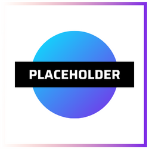

<div id="top"></div>
<!--
*** Thanks for checking out the Best-README-Template. If you have a suggestion
*** that would make this better, please fork the repo and create a pull request
*** or simply open an issue with the tag "enhancement".
*** Don't forget to give the project a star!
*** Thanks again! Now go create something AMAZING! :D
-->


<!-- PROJECT SHIELDS -->
<!--
*** I'm using markdown "reference style" links for readability.
*** Reference links are enclosed in brackets [ ] instead of parentheses ( ).
*** See the bottom of this document for the declaration of the reference variables
*** for contributors-url, forks-url, etc. This is an optional, concise syntax you may use.
*** https://www.markdownguide.org/basic-syntax/#reference-style-links
-->
[![Contributors][contributors-shield]](https://github.com/MSBivens/dnft_character_builder/graphs/contributors)
[![Forks][forks-shield]][https://github.com/MSBivens/dnft_character_builder/network/members]
[![Stargazers][stars-shield]][https://github.com/MSBivens/dnft_character_builder/stargazers]
[![Issues][issues-shield]][https://github.com/MSBivens/dnft_character_builder/issues]
[![MIT License][license-shield]][https://github.com/MSBivens/dnft_character_builder/blob/master/LICENSE.txt]


<!-- PROJECT LOGO -->
<br />
<div align="center">
  <a href="https://github.com/MSBivens/dnft_character_builder">
    
  </a>

<h3 align="center">dNFT Character Builder</h3>

  <p align="center">
    project_description
    <br />
    <a href="https://github.com/MSBivens/dnft_character_builder"><strong>Explore the docs »</strong></a>
    <br />
    <br />
    <a href="https://github.com/github_username/repo_name">View Demo</a>
    ·
    <a href="https://github.com/github_username/repo_name/issues">Report Bug</a>
    ·
    <a href="https://github.com/github_username/repo_name/issues">Request Feature</a>
  </p>
</div>


<!-- TABLE OF CONTENTS -->
<details>
  <summary>Table of Contents</summary>
  <ol>
    <li>
      <a href="#about-the-project">About The Project</a>
      <ul>
        <li><a href="#built-with">Built With</a></li>
      </ul>
    </li>
    <li>
      <a href="#getting-started">Getting Started</a>
      <ul>
        <li><a href="#prerequisites">Prerequisites</a></li>
        <li><a href="#installation">Installation</a></li>
      </ul>
    </li>
    <li><a href="#usage">Usage</a></li>
    <li><a href="#roadmap">Roadmap</a></li>
    <li><a href="#contributing">Contributing</a></li>
    <li><a href="#license">License</a></li>
    <li><a href="#contact">Contact</a></li>
    <li><a href="#acknowledgments">Acknowledgments</a></li>
  </ol>
</details>


<!-- ABOUT THE PROJECT -->
## About The Project

[![Product Name Screen Shot][product-screenshot]](https://example.com)

This builder is meant to serve as working demo and template for character building via a dNFT. Created during the Chainlink Spring 2022 Hackathon.


<p align="right">(<a href="#top">back to top</a>)</p>


### Built With

* [Flask](https://flask.palletsprojects.com/en/2.1.x/)
* [Bootstrap](https://getbootstrap.com)

<p align="right">(<a href="#top">back to top</a>)</p>


<!-- GETTING STARTED -->
## Getting Started

To set up the project locally follow these simple example steps.

### Prerequisites

This is an example of how to list things you need to use the software and how to install them.
* npm
  ```sh
  npm install npm@latest -g
  ```

### Installation

1. Clone the repo
   ```sh
   git clone https://github.com/MSBivens/dnft_character_builder.git
   ```
2. Install NPM packages
   ```sh
   npm install
   ```

<p align="right">(<a href="#top">back to top</a>)</p>


<!-- USAGE EXAMPLES -->
## Usage

This project is intended to show a working example of how game developers could use dNFTs for character creation and development. Dynamic NFTs allow for the metadata to be updated via smart contract triggers. 

A game developer could clone this repo and use it in their game to allow players to update their characters with elements like items that chagne the metadata of their NFT, trigger class changes, or gain access to new areas.

_For more information on dNFTs, please refer to [Chainlinks Article](https://blog.chain.link/what-is-a-dynamic-nft/)_

<p align="right">(<a href="#top">back to top</a>)</p>


<!-- ROADMAP -->
## Roadmap

- [ ] Complete a working demo with genesis collection
- [ ] Implement additional customization options
    - [ ] Additional options for current custoimization categories
    - [ ] New characters for base dNFT
    - [ ] New customization options
- [ ] Create an inventory system
    - [ ] Implement item options 

See the [open issues](https://github.com/MSBivens/dnft_character_builder/issues) for a full list of proposed features (and known issues).

<p align="right">(<a href="#top">back to top</a>)</p>


<!-- CONTRIBUTING -->
## Contributing

Any contributions you make are **greatly appreciated** and ultimately serve to help the community and developers push for new innovations.

If you have a suggestion that would make this better, please fork the repo and create a pull request. You can also simply open an issue with the tag "expansion".
Don't forget to give the project a star! Thanks again!

1. Fork the Project
2. Create your Feature Branch (`git checkout -b feature/AmazingFeature`)
3. Commit your Changes (`git commit -m 'Add some AmazingFeature'`)
4. Push to the Branch (`git push origin feature/AmazingFeature`)
5. Open a Pull Request

<p align="right">(<a href="#top">back to top</a>)</p>


<!-- LICENSE -->
## License

Distributed under the MIT License. See `LICENSE.txt` for more information.

<p align="right">(<a href="#top">back to top</a>)</p>


<!-- CONTACT -->
## Contact
<!-- Add names to LICENSE.txt -->
Original Contributers:

Mike Bivens - [Twitter](https://twitter.com/MSBivens_) - [LinkedIn](https://www.linkedin.com/in/msbivens/) - [GitHub](https://github.com/MSBivens)

Eric Brusky - [LinkedIn](https://www.linkedin.com/in/eric-brusky/)


Project Link: [https://github.com/MSBivens/dnft_character_builder](https://github.com/MSBivens/dnft_character_builder)

<p align="right">(<a href="#top">back to top</a>)</p>


<!-- ACKNOWLEDGMENTS -->
## Acknowledgments

* [Shields IO](https://shields.io/)

<p align="right">(<a href="#top">back to top</a>)</p>


<!-- MARKDOWN LINKS & IMAGES -->
<!-- https://www.markdownguide.org/basic-syntax/#reference-style-links -->
[contributors-shield]: https://img.shields.io/github/contributors/github_username/repo_name.svg?style=for-the-badge
[contributors-url]: https://github.com/github_username/repo_name/graphs/contributors
[forks-shield]: https://img.shields.io/github/forks/github_username/repo_name.svg?style=for-the-badge
[forks-url]: https://github.com/github_username/repo_name/network/members
[stars-shield]: https://img.shields.io/github/stars/github_username/repo_name.svg?style=for-the-badge
[stars-url]: https://github.com/github_username/repo_name/stargazers
[issues-shield]: https://img.shields.io/github/issues/github_username/repo_name.svg?style=for-the-badge
[issues-url]: https://github.com/github_username/repo_name/issues
[license-shield]: https://img.shields.io/github/license/github_username/repo_name.svg?style=for-the-badge
[license-url]: https://github.com/github_username/repo_name/blob/master/LICENSE.txt
[linkedin-shield]: https://img.shields.io/badge/-LinkedIn-black.svg?style=for-the-badge&logo=linkedin&colorB=555
[linkedin-url]: https://linkedin.com/in/linkedin_username
[product-screenshot]: images/screenshot.png
